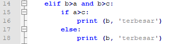

# CARA MENAMPILKAN BILANGAN TERBESAR MENGGUNAKAN PYTHON
1. Buka notepad++

2. Masukan kodingannya seperti gambar dibawah ini

3. Jika kodingan selesai dan tidak ada eror simpan kodingan tersebut.

4. Berikut penjelasan tentang kodingan tersebut :

A. input (Sebagai masukan atau input program)

B. if

C. elif

D. else

E. output (Sebagai penampil program)

5. berikut ini adalah hasil eksekusi program

6. Selesai

